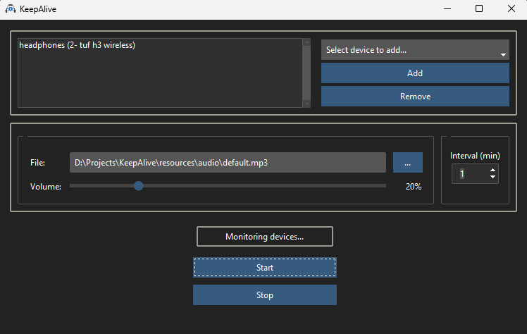

# KeepAlive 

## Description
A simple Python application with a GUI built using tkinter (and themed with ttkbootstrap) designed to prevent wireless headphones/headsets from entering sleep mode or automatically disconnecting due to inactivity. It achieves this by periodically playing a short, customizable sound in the background when a selected audio output device is detected.

Users can:
*   Select one or more specific headset/output device names to monitor.
*   Choose a custom sound file (MP3 or WAV) to be played.
*   Adjust the playback volume.
*   Set the interval (in minutes) between sound plays.



## Features
*   **Customizable Audio:** Select any MP3 or WAV file to use as the keep-alive sound.
*   **Volume Control:** Adjust the playback volume via a slider.
*   **Configurable Interval:** Set how often (in minutes) the sound should play.
*   **Device Detection:** Automatically lists available audio output devices.
*   **Persistent Settings:** Saves your configuration (`headsets`, `sound_file`, `volume`, `interval`) to a `settings.json` file.

## Requirements
*   **Python:** 3.12 or higher 
*   **Libraries:** See `requirements.txt`. Key dependencies include:

## Installation & Setup

1.  **Clone the repository:**
    ```bash
    git clone https://github.com/R0bert-BLN/KeepAlive.git
    cd KeepAlive
    ```

2.  **Create and activate a virtual environment:**
    ```bash
    # Create venv
    python -m venv venv

    # Activate venv
    # Windows (PowerShell/CMD):
    .\venv\Scripts\activate
    ```

3.  **Install dependencies:**
    ```bash
    pip install -r requirements.txt
    ```

## Usage

To run the application, navigate to the project's root directory (`KeepAlive`) in your terminal (with the virtual environment activated) and run:

```bash
    python -m src.main
```
